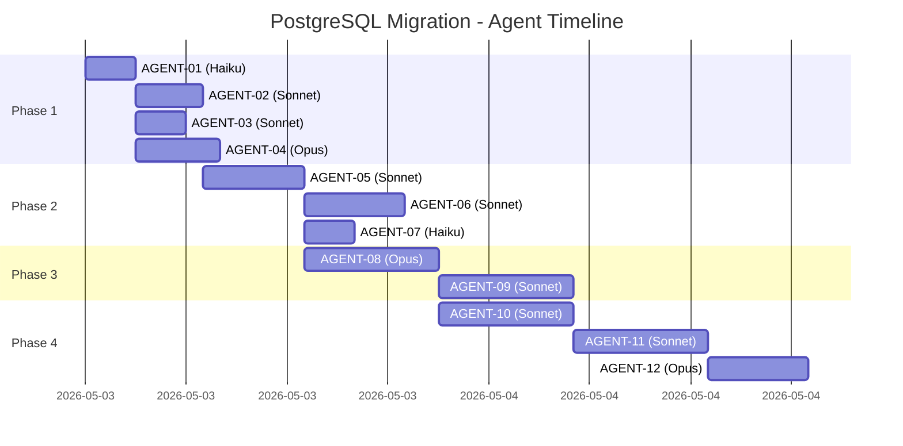

# Agent Orchestration Guide

**Hướng dẫn điều phối 12 agents để thực thi PostgreSQL Migration project**

---

## 🎯 Execution Strategy

### Sequential vs Parallel



---

## 📅 Day-by-Day Execution Plan

### Day 1: Foundation (Phase 1 Start)

**Morning (9:00 - 12:00)**
```bash
# Start AGENT-01 (Haiku - 3h)
claude --agent .claude/agent-01-repo-setup.md

# Wait for completion, verify deliverables
git tag | grep v0.1.0-pre-migration
ls /tmp/pocketbase-v0.37.5/
ls /tmp/postgrebase/
```

**Afternoon (13:00 - 18:00)**
```bash
# Launch Phase 1 agents in parallel (5h max)
# Terminal 1
claude --agent .claude/agent-02-code-extraction.md

# Terminal 2
claude --agent .claude/agent-03-dependency-analysis.md

# Terminal 3
claude --agent .claude/agent-04-dbx-package.md

# Monitor progress
watch -n 300 'grep "\\[x\\]" PROJECT_TRACKING.md | wc -l'
```

**End of Day 1**
- ✅ AGENT-01 complete
- 🔵 AGENT-02, 03, 04 in progress (might finish by EOD)

---

### Day 2: Phase 1 Completion + Phase 2 Start

**Morning (9:00 - 12:00)**
```bash
# Verify Phase 1 agents completed
grep "Phase 1" PROJECT_TRACKING.md -A 200 | grep "✅ Complete" | wc -l
# Should output: 4

# Check deliverables
ls -la docs/extracted/
cat docs/dependency-comparison.md
cat docs/dbx-vendoring-strategy.md

# Start AGENT-05 (depends on 02+03)
claude --agent .claude/agent-05-db-connection.md
```

**Afternoon (13:00 - 18:00)**
```bash
# After AGENT-05 completes, launch Phase 2 parallel agents
# Terminal 1
claude --agent .claude/agent-06-redis.md

# Terminal 2
claude --agent .claude/agent-07-cli-flags.md

# Verify Phase 2
cat docs/implementation/core_db_postgresql.go
grep "initRedis" docs/implementation/redis_client_init.go
```

**End of Day 2**
- ✅ Phase 1 complete (AGENT-01 to 04)
- ✅ AGENT-05 complete
- 🔵 AGENT-06, 07 in progress

---

### Day 3: Phase 2 Completion + Phase 3 Start

**Morning (9:00 - 12:00)**
```bash
# Verify Phase 2 completion
grep "AGENT-06\|AGENT-07" PROJECT_TRACKING.md -A 20 | grep "Status"

# Start AGENT-08 (complex, needs Opus)
claude --agent .claude/agent-08-dbx-vendor.md
```

**Afternoon (13:00 - 18:00)**
```bash
# Continue AGENT-08 (8 hour task)
# This is complex vendoring work, will extend to Day 4

# Prepare for AGENT-09
cat docs/sql-dialect-conversion-matrix.md
```

**End of Day 3**
- ✅ Phase 2 complete (AGENT-05 to 07)
- 🔵 AGENT-08 in progress (8h task)

---

### Day 4: Phase 3 (dbx Vendoring + Migrations)

**Morning (9:00 - 12:00)**
```bash
# Complete AGENT-08
# Verify vendoring
grep "vendor/dbx" docs/vendoring/import-path-changes.md | wc -l

# Start AGENT-09 immediately after
claude --agent .claude/agent-09-migrations.md
```

**Afternoon (13:00 - 18:00)**
```bash
# Continue AGENT-09 (8 hour task)
# SQL conversion is time-consuming

# Monitor migration conversion
ls -la docs/migrations/postgresql-migrations/
bash docs/migrations/conversion-script.sh --dry-run
```

**End of Day 4**
- ✅ AGENT-08 complete
- 🔵 AGENT-09 in progress

---

### Day 5: Phase 3 Completion + Phase 4 Start (Testing)

**Morning (9:00 - 12:00)**
```bash
# Complete AGENT-09
cat docs/migrations/rollback-test-results.md

# Start AGENT-10 (Unit Tests)
claude --agent .claude/agent-10-unit-tests.md
```

**Afternoon (13:00 - 18:00)**
```bash
# Continue AGENT-10 (8 hour task)
# Unit test generation

# Monitor test creation
grep "func Test" docs/tests/*.go | wc -l
```

**End of Day 5**
- ✅ Phase 3 complete (AGENT-08, 09)
- 🔵 AGENT-10 in progress

---

### Day 6: Phase 4 Continuation (Integration Tests)

**Morning (9:00 - 12:00)**
```bash
# Complete AGENT-10
cat docs/tests/unit-test-results.md | grep "coverage:"

# Start AGENT-11 (Integration Tests)
claude --agent .claude/agent-11-integration-tests.md
```

**Afternoon (13:00 - 18:00)**
```bash
# Continue AGENT-11 (8 hour task)
# E2E test setup

# Test infrastructure
docker-compose -f docs/tests/docker-compose.test.yml up -d
```

**End of Day 6**
- ✅ AGENT-10 complete
- 🔵 AGENT-11 in progress

---

### Day 7: Final Agent (Performance Benchmarks)

**Morning (9:00 - 12:00)**
```bash
# Complete AGENT-11
cat docs/tests/integration-test-results.md | grep "PASS"

# Start AGENT-12 (Final agent - Opus)
claude --agent .claude/agent-12-benchmarks.md
```

**Afternoon (13:00 - 18:00)**
```bash
# Complete AGENT-12 (6 hour task)
# Performance analysis + optimization recommendations

# Final verification
cat docs/benchmarks/benchmark-results.md
cat docs/benchmarks/optimization-recommendations.md
```

**End of Day 7**
- ✅ ALL AGENTS COMPLETE! 🎉
- ✅ Project ready for implementation

---

## 🔄 Dependency Matrix

### Critical Path (Sequential)
```
AGENT-01 → AGENT-02 → AGENT-05 → AGENT-08 → AGENT-09 → AGENT-10 → AGENT-11 → AGENT-12
```
**Total Critical Path**: ~51 hours

### Parallel Opportunities

**Phase 1 Parallel Block** (after AGENT-01):
```
AGENT-02 (4h) ┐
AGENT-03 (3h) ├─ Can run in parallel
AGENT-04 (5h) ┘
```
**Saves**: 7 hours (12h → 5h)

**Phase 2 Parallel Block** (after AGENT-05):
```
AGENT-06 (6h) ┐
AGENT-07 (3h) ┘─ Can run in parallel
```
**Saves**: 3 hours (9h → 6h)

**Total Time Savings**: ~10 hours

---

## 🎛️ Orchestration Commands

### Launch Parallel Agents (Phase 1)

```bash
#!/bin/bash
# phase1-parallel.sh

echo "🚀 Launching Phase 1 parallel agents..."

# Terminal multiplexer (tmux)
tmux new-session -d -s migration

# Launch agents in separate panes
tmux split-window -h -t migration
tmux split-window -v -t migration:0.0

tmux send-keys -t migration:0.0 'claude --agent .claude/agent-02-code-extraction.md' C-m
tmux send-keys -t migration:0.1 'claude --agent .claude/agent-03-dependency-analysis.md' C-m
tmux send-keys -t migration:0.2 'claude --agent .claude/agent-04-dbx-package.md' C-m

tmux attach -t migration
```

### Monitor Progress

```bash
#!/bin/bash
# monitor-progress.sh

while true; do
    clear
    echo "=== PostgreSQL Migration Progress ==="
    echo ""
    
    # Overall progress
    COMPLETED=$(grep -c "\[x\]" PROJECT_TRACKING.md)
    TOTAL=$(grep -c "\[ \]\|\[x\]" PROJECT_TRACKING.md)
    PERCENTAGE=$(echo "scale=1; $COMPLETED * 100 / $TOTAL" | bc)
    
    echo "Overall: $COMPLETED / $TOTAL tasks ($PERCENTAGE%)"
    echo ""
    
    # Agent status
    echo "Agent Status:"
    grep -E "AGENT-[0-9]{2}.*Status" PROJECT_TRACKING.md | while read line; do
        echo "  $line"
    done
    
    echo ""
    echo "Press Ctrl+C to exit"
    sleep 30
done
```

### Verify Dependencies

```bash
#!/bin/bash
# verify-dependencies.sh

AGENT_ID=$1

if [ -z "$AGENT_ID" ]; then
    echo "Usage: ./verify-dependencies.sh AGENT-XX"
    exit 1
fi

echo "=== Checking dependencies for $AGENT_ID ==="
echo ""

# Get dependencies
DEPS=$(grep "$AGENT_ID" PROJECT_TRACKING.md -A 5 | grep "Dependencies:" | cut -d: -f2)

echo "Dependencies: $DEPS"
echo ""

# Check each dependency
echo "Dependency Status:"
for DEP in $DEPS; do
    if [ "$DEP" = "None" ]; then
        echo "  ✅ No dependencies - can start immediately"
    else
        STATUS=$(grep "$DEP" PROJECT_TRACKING.md -A 2 | grep "Status:" | grep -o "✅\|🔵\|🟢\|🟡")
        if [ "$STATUS" = "✅" ]; then
            echo "  ✅ $DEP: Complete"
        else
            echo "  ❌ $DEP: Not complete ($STATUS)"
        fi
    fi
done
```

---

## 📊 Resource Allocation

### Model Distribution

| Model | Agents | Total Hours | % of Project |
|-------|--------|-------------|--------------|
| **Haiku** | 2 | 6h | 9% |
| **Sonnet** | 7 | 43h | 63% |
| **Opus** | 3 | 19h | 28% |
| **TOTAL** | 12 | 68h | 100% |

### Parallel Execution Efficiency

```
Sequential Execution: 68 hours (~8.5 days)
Parallel Execution:   ~51 hours (~6.4 days)
Efficiency Gain:      ~25% faster
```

---

## 🔧 Troubleshooting Orchestration

### Agent Won't Start

```bash
# Check dependencies
./verify-dependencies.sh AGENT-XX

# Check blocked status
grep "AGENT-XX" PROJECT_TRACKING.md -A 3 | grep "Status"
```

### Agent Failed Mid-Task

```bash
# Resume from last checkpoint
grep "AGENT-XX" PROJECT_TRACKING.md -A 100 | grep "\[x\]"

# Identify failed task
grep "AGENT-XX" PROJECT_TRACKING.md -A 100 | grep "\[ \]" | head -1

# Post failure report (see CLAUDE.md)
```

### Parallel Agents Conflicting

```bash
# Check file conflicts
git status

# Resolve using merge strategy
git checkout --theirs path/to/file  # or --ours

# Re-run verification for conflicted agent
```

---

## 📈 Success Metrics

### Project Completion Checklist

- [ ] All 12 agents status = ✅
- [ ] All tasks in PROJECT_TRACKING.md = [x]
- [ ] All deliverable files exist in docs/
- [ ] All verification commands pass
- [ ] Final completion report posted
- [ ] DASHBOARD.md shows 100%

### Quality Gates

**After Phase 1**:
- [ ] 4 agents complete
- [ ] All extraction docs exist
- [ ] No blockers for Phase 2

**After Phase 2**:
- [ ] 7 agents complete
- [ ] Core implementation documented
- [ ] Compilation tests pass

**After Phase 3**:
- [ ] 9 agents complete
- [ ] dbx package vendored
- [ ] Migrations converted

**After Phase 4**:
- [ ] 12 agents complete
- [ ] All tests pass
- [ ] Benchmarks acceptable

---

## 🎓 Lessons Learned (Post-Project)

*To be filled after project completion*

### What Worked Well
- [ ] Model selection strategy
- [ ] Parallel execution
- [ ] Dependency management
- [ ] Documentation structure

### What Could Be Improved
- [ ] Agent hand-off process
- [ ] Verification automation
- [ ] Progress tracking
- [ ] Error recovery

### Model Performance Notes
*Document which models performed best/worst for specific tasks*

---

**Created**: 2026-05-03  
**Version**: 1.0  
**Estimated Completion**: 2026-05-11 (7 working days with parallel execution)
